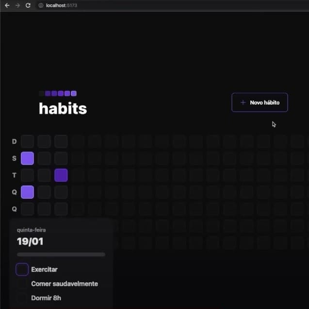

<h1 align="center"> Habits </h1>

Programa exclusivo e gratuito, promovido pela Rocketseat para ensino de tecnologias WEB.  

  <a href="#-tecnologias">Tecnologias</a>&nbsp;&nbsp;&nbsp;|&nbsp;&nbsp;&nbsp;
  <a href="#-projeto">Projeto</a>&nbsp;&nbsp;&nbsp;|&nbsp;&nbsp;&nbsp;
  <a href="#-layout">Layout</a>&nbsp;&nbsp;&nbsp;|&nbsp;&nbsp;&nbsp;
  <a href="#memo-licença">Licença</a>

  

 

  

## 🚀 Tecnologias

Esse projeto foi desenvolvido com as seguintes tecnologias:

- HTML e CSS
- Javascript
- Typescript
- Prisma
- Tailwind
- Git e Github
- Figma

## 💻 Projeto

Este **projeto** consiste em ajudar você a fazer uma checklist do seu dia a dia, **registrando os hábitos** feitos e acompanhando de forma precisa os seus hábitos **diários**.

## 🔖 Layout

Você pode visualizar o layout do projeto através [desse link](https://www.figma.com/file/UDDsvA7nIqR5VYCUqqT82i/Habits-(i)-(Community)?node-id=6%3A343&t=JRj1LsM8xDER7Yb9-0). É necessário ter conta no [Figma](https://figma.com) para acessá-lo.

## :memo: Licença

Esse projeto está sob a licença MIT.

---

Feito com ♥ by Rocketseat [Participe da nossa comunidade!](https://discord.gg/rocketseat)
